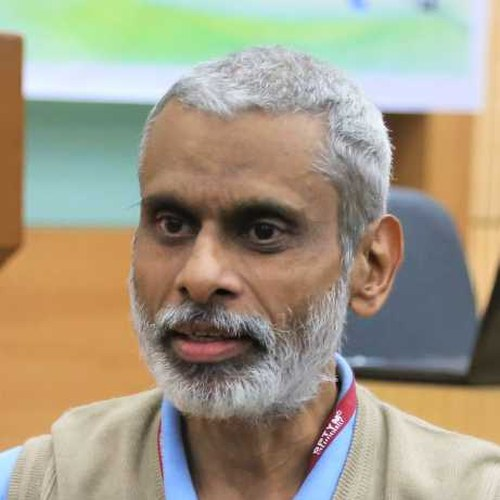

# JAW 2026 — Joint APPCAIR Workshop

Website for the second edition of the Joint APPCAIR Workshop, hosted by APPCAIR at
BITS Pilani, Pilani Campus on **14-15 August 2026**.

## How it works

Plain static HTML, CSS and JavaScript. No build step, no framework, no dependencies.
Push to `main` and GitHub Pages redeploys within a minute or two.

The styling is the [CAISc 2026](https://caisc2026.github.io/) stylesheet, used so the two
sites read as a family. The only palette change is `--accent`, swapped from CAISc teal to
the APPCAIR brand indigo `#2E3192` sampled from the official APPCAIR lockup. A short
"JAW 2026 additions" block at the bottom of `styles.css` holds the few components the
CAISc base does not cover.

```
index.html        the single-page site (all sections)
hackathon.html    "details coming soon" stub
posters.html      "details coming soon" stub
register.html     "details coming soon" stub
styles.css        CAISc base + JAW additions at the end
script.js         theme toggle and mobile menu
assets/
  favicon.svg
  logos/          BITS Pilani crest, APPCAIR mark and lockup
  speakers/       drop speaker photos here (see below)
```

## Editing content

Everything on the front page lives in `index.html`, grouped under commented section
banners (`<!-- Speakers Section -->` and so on). Open it in any editor, change the text,
commit.

### Adding a speaker

Copy an existing `<div class="team-member">` block in the Speakers section and edit the
name, institution and day. Only add speakers who have confirmed.

To use a photo instead of the initials placeholder, put a square image in
`assets/speakers/` and swap the inner span:

```html
<!-- from -->
<span class="team-member__image-placeholder">NH</span>
<!-- to -->

```

The circular crop is applied automatically. Square images around 400x400 work best.

### Filling in a stub page

`hackathon.html`, `posters.html` and `register.html` share the same layout. Replace the
`<section class="content-section stub-page">` contents with the real details, then remove
the `<span class="pill">Coming soon</span>` badge from the matching card in the "Take Part"
section of `index.html`.

### Adding sponsor logos

Add a second `.supported-by` block (copy the one in the hero) with a
`With Support From` label, and drop logo files into `assets/logos/`.

### Colours

All colours are CSS custom properties in the `:root` block at the top of `styles.css`.
Changing `--accent` (and the `[data-theme="dark"]` override below it) reskins the whole
site.

## Running locally

```bash
python3 -m http.server 8000
# then open http://localhost:8000
```

## Still to confirm

- Full names for committee members currently listed by first name only
  (Prashant, Siddharth, Pranjal, Devanshu, Piyush)
- Whether "Prashant" in the research-talks and local-organisation portfolios is one
  person or two different people
- Talk titles and abstracts for the confirmed speakers
- Hackathon theme, format, eligibility, prizes, registration link
- Call for posters: deadline, format, submission route, cross-campus participation
- Registration form and closing date
- Travel and accommodation detail for the Venue section (the airport and railhead
  distances currently on the page are approximate and should be checked)
- Sponsor logos, once confirmed
